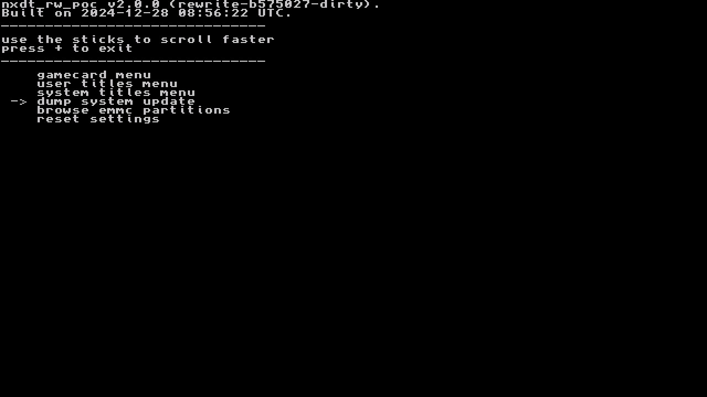
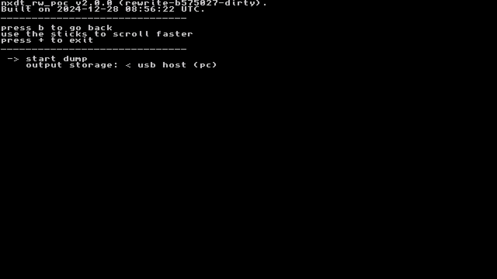

# Firmware

- Launch Homebrew Menu and open NXDumpTool (nxdt_rw_poc).
  

- Select `dump system update`
  

- Select `start dump`
  

- If you have setup [USB dumping](usb-dumping.md) you can dump straight to a PC if you `set output storage`: to `usb host (pc)`
- If you set output to `usb host (PC)`, make sure nxdt_host is open on your PC, then connect your Switch. Dumping will begin.
