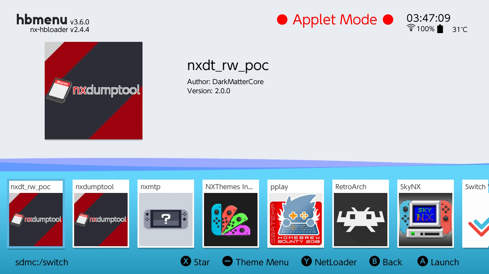
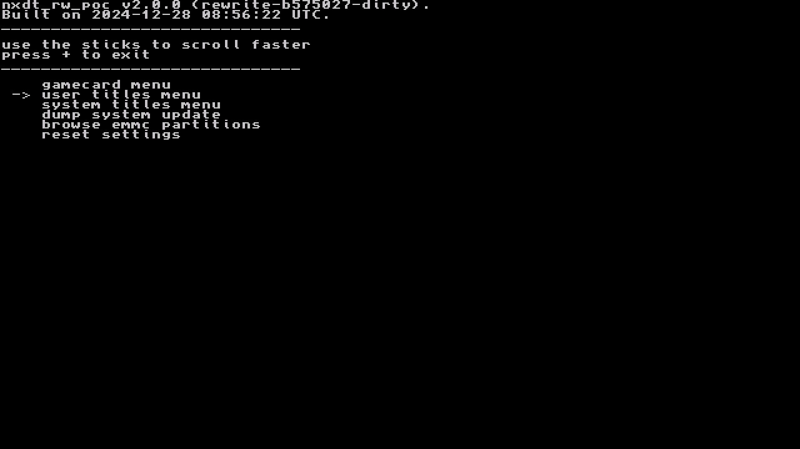
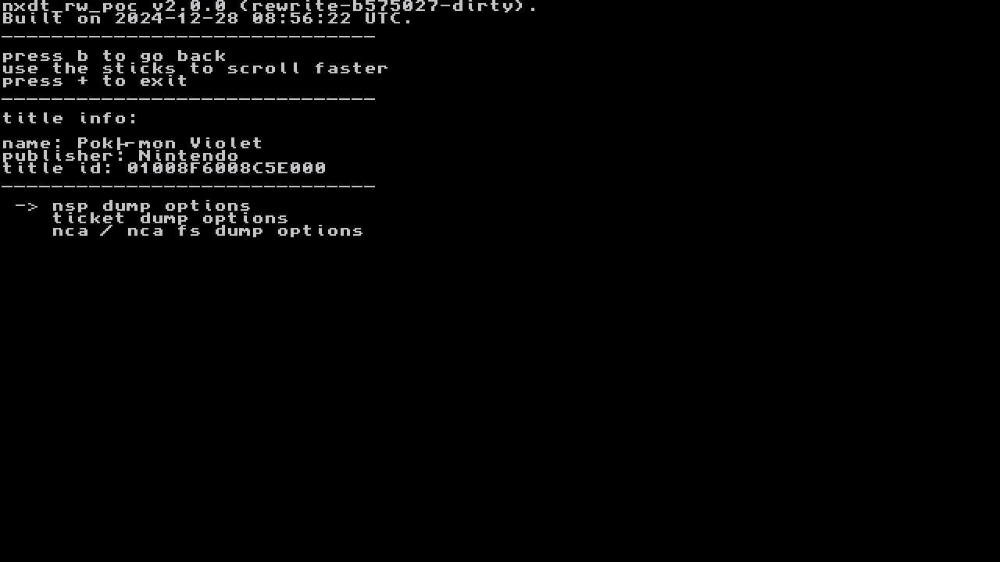
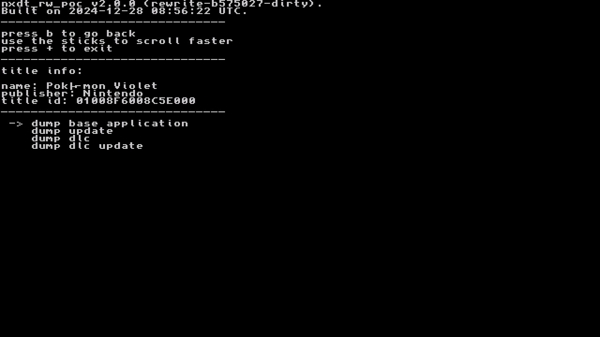
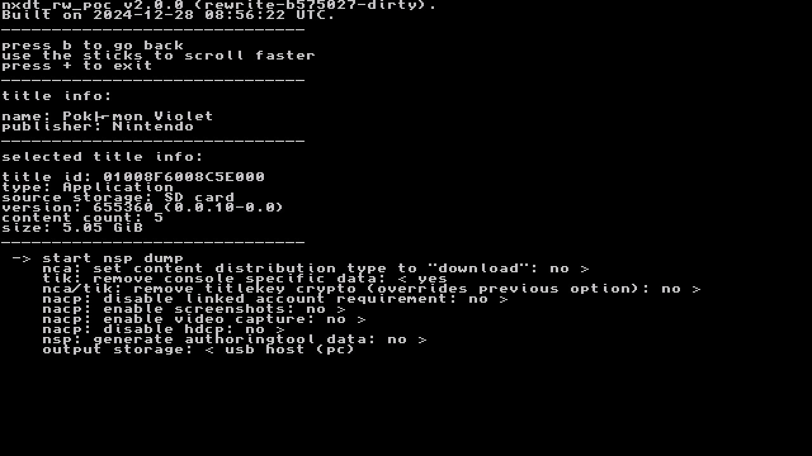
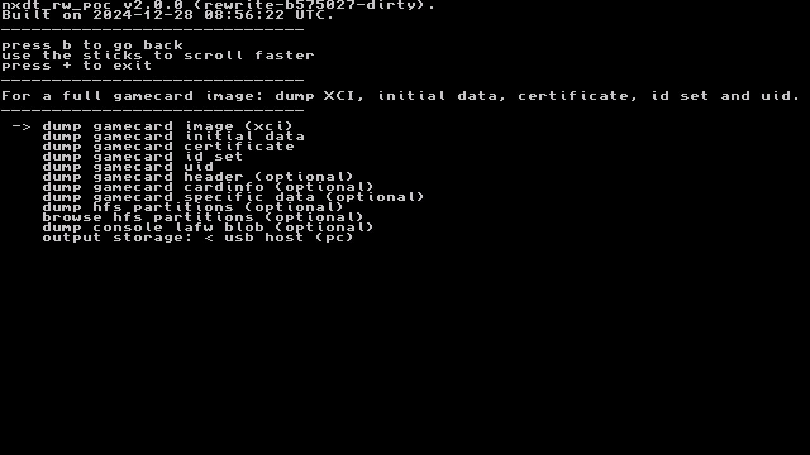
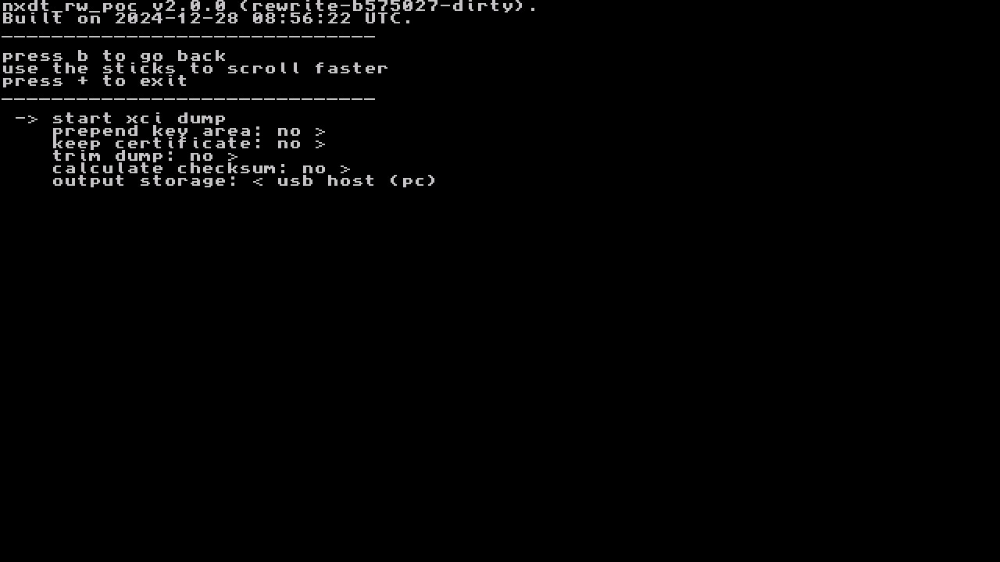
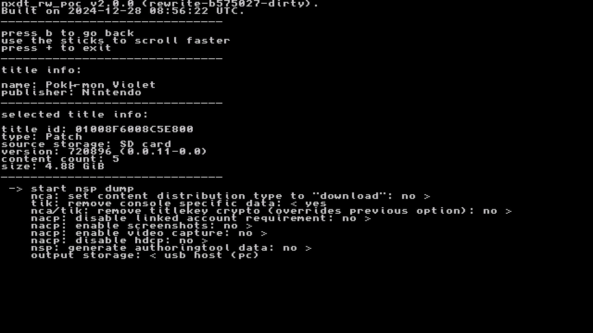
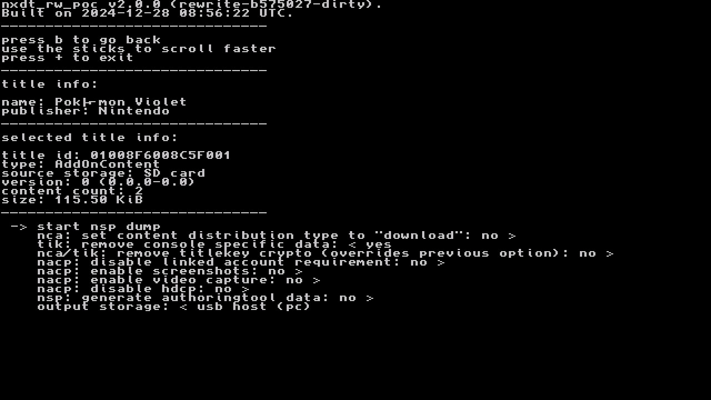

# Base Game

??? "e-Shop Digital (NSP)"

    - Launch Homebrew Menu and open NXDumpTool (nxdt_rw_poc).
      

    - Select `user titles menu`
      

    - Find the game you want to dump and select it.
      - Select `nsp dump options` --> `dump base application`
      
      

    - If you have setup [USB dumping](usb-dumping.md) you can dump straight to a PC if you `set output storage`: to `usb host (pc)`
    - Select `start nsp dump`
      
  
    - If you set output to `usb host (PC)`, make sure nxdt_host is open on your PC, then connect your Switch. Dumping will begin.

??? "Physical Cartridge (XCI)"

    - Launch Homebrew Menu and open NXDumpTool (nxdt_rw_poc).
      

    - Select `gamecard menu`
      

    - Select `dump gamecard image (xci)`
      

    - If you have setup [USB dumping](usb-dumping.md) you can dump straight to a PC 
      if you `set output storage`: to `usb host (pc)`
    - Select `start xci dump`
      

    - If you set output to `usb host (PC)`, make sure nxdt_host is open on your PC, then connect your Switch. 
      Dumping will begin.

# Updates & DLC

- Launch Homebrew Menu and open NXDumpTool (nxdt_rw_poc).
  

- Select `user titles menu`
  

- Find the game you want to dump and select it.
- Select `dump update` to dump an update, or `dump dlc` to dump DLC for the game.
  
  
- If dumping DLC, press `L/ZL` or `R/ZR` to change the selected DLC title to dump.
- If you have setup [USB dumping](usb-dumping.md) you can dump straight to a PC if you `set output storage`: to `usb host (pc)`
- Select `start nsp dump`
  
  

- If you set output to `usb host (PC)`, make sure nxdt_host is open on your PC, then connect your Switch. Dumping will begin.
