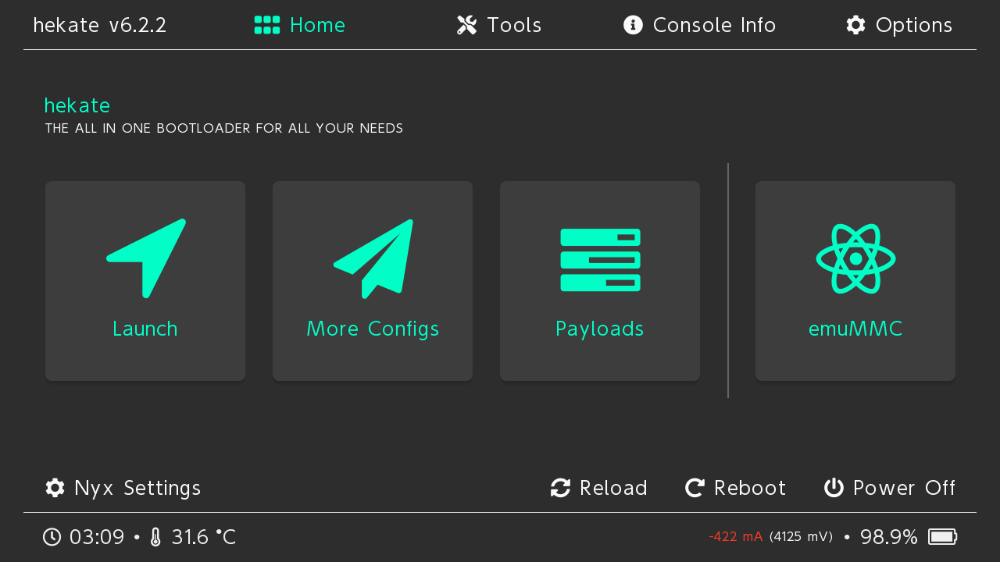
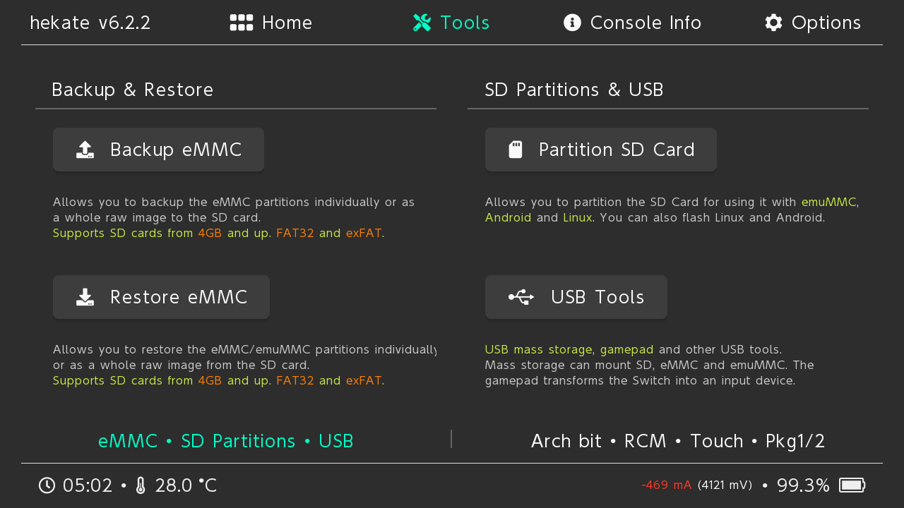
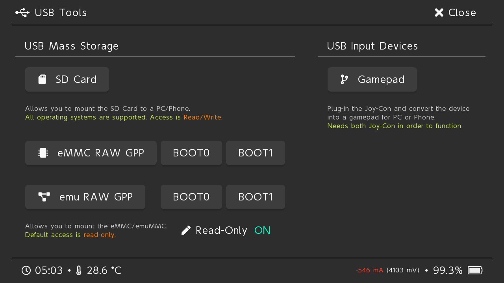

## What You Need

  1. Unpatched/Modchipped Switch
  2. Lockpick_RCM
  3. MicroSD Card (64GB+)

## How to Backup Switch Keys

1. Download Lockpick_RCM unless you already have it.
2. Put the `Lockpick_RCM.bin` into the `bootloader/payloads` folder on your microSD card.
3. Boot `Hekate` and launch Lockpick_RCM.bin from the payloads tab.
  

4. Select `Dump from sysNAND`. Lockpick_RCM will dump the `prod.keys`, `title.keys` and `dev.keys` to the `switch folder` on your microSD card.
5. Exit back to the Lockpick_RCM home screen.
6. If you have games installed to emuNAND you can dump title.keys by selecting Dump from EmuNAND in Lockpick_RCM.
7. Either: 
    - reboot to `Hekate` choose `tools` --> `USB Tools` --> `SD card` under USB Mass Storage while connected to your PC;
    - or power off and copy the prod.keys, title.keys and dev.keys from the `switch` folder on your microSD card to your PC.

